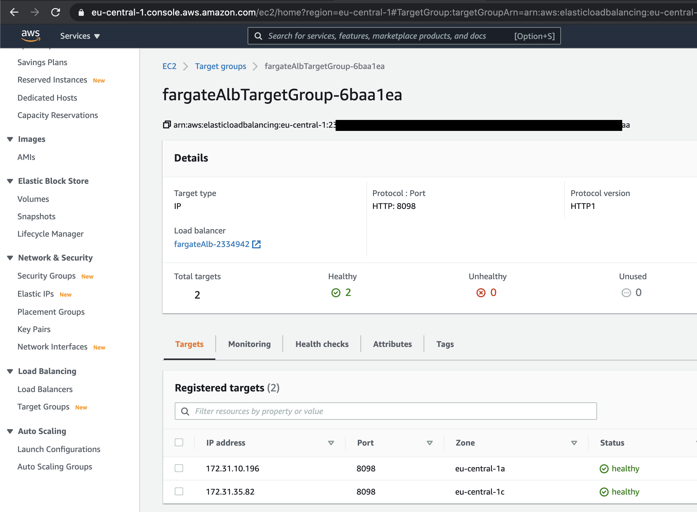
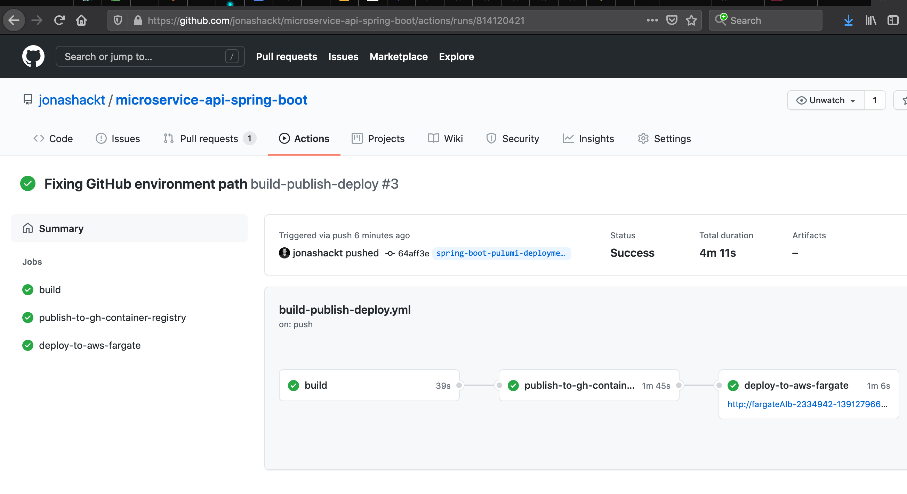

# microservice-api-spring-boot
[](https://github.com/jonashackt/microservice-api-spring-boot/actions)
[](https://renovatebot.com)
[](https://github.com/spring-projects/spring-boot)

Example project showing how to interact with a Nuxt.js / Vue.js based frontend (https://github.com/jonashackt/microservice-ui-nuxt-js) building a Spring Boot microservice
```shell
┌────────────────────────────────┐
│                                │
│                                │
│    microservice-ui-nuxt-js     │
│                                │
│                                │
└───────────────┬────────────────┘
                │
                │
┌───────────────▼────────────────┐
│                                │
│                                │
│  microservice-api-spring-boot  │
│                                │
│                                │
└────────────────────────────────┘
```

Most of the source is simply copied from my project https://github.com/jonashackt/spring-boot-vuejs/tree/master/backend


## Acting as API backend for Nuxt.js frontend

We have a slightly different deployment than the single one in https://github.com/jonashackt/spring-boot-vuejs here, where we deployed everything (including the frontend) into a Spring Boot embedded Tomcat.

Now we deploy the frontend separately from the backend - which also has some implications on the backend, since it only acts as the API now.


#### Combine CORS & Spring Security

Therefore we can remove the [SpaRedirectFilterConfiguration.java](https://github.com/jonashackt/spring-boot-vuejs/blob/master/backend/src/main/java/de/jonashackt/springbootvuejs/configuration/SpaRedirectFilterConfiguration.java) and need to add a `org.springframework.web.bind.annotation.CrossOrigin` Annotation with `@CrossOrigin` to our [BackendController.java](src/main/java/de/jonashackt/springbootvuejs/controller/BackendController.java):

```java
import org.springframework.stereotype.Controller;
import org.springframework.web.bind.annotation.CrossOrigin;
import org.springframework.web.bind.annotation.RequestMapping;

@Controller
@RequestMapping("/api")
@CrossOrigin
public class BackendController {
    ...
}
```

https://stackoverflow.com/a/37610988/4964553 states:

> To make it work, you need to explicitly enable CORS support at Spring Security level as following, otherwise CORS enabled requests may be blocked by Spring Security before reaching Spring MVC.

So we need to mind the Spring Security integration! Using the `@CrossOrigin` annotation, we can simply add `and().cors()` to our [WebSecurityConfiguration.java](src/main/java/de/jonashackt/springbootvuejs/configuration/WebSecurityConfiguration.java):

```java
    http
            .sessionManagement().sessionCreationPolicy(SessionCreationPolicy.STATELESS) // No session will be created or used by spring security
        .and()
            .httpBasic()
        .and()
            .authorizeRequests()
                .antMatchers("/api/hello").permitAll()
                .antMatchers("/api/user/**").permitAll() // allow every URI, that begins with '/api/user/'
                .antMatchers("/api/secured").authenticated()
                //.anyRequest().authenticated() // protect all other requests
        .and()
            .cors() // We need to add CORS support to Spring Security (see https://stackoverflow.com/a/37610988/4964553)
        .and()
            .csrf().disable(); // disable cross site request forgery, as we don't use cookies - otherwise ALL PUT, POST, DELETE will get HTTP 403!
```

See https://stackoverflow.com/a/67583232/4964553 for a full explanation.


## GitHub Actions: Build, create Container Image with Paketo.io & Publish to GitHub Container Registry

Our [build-publish-deploy.yml](.github/workflows/build-publish-deploy.yml) already builds our Java/Spring Boot app using JDK 16. It also uses Paketo.io / Cloud Native Buildpacks to create a Container image (incl. a Paketo cache image to speed up builds, see https://stackoverflow.com/a/66598693/4964553) and publish it to GitHub Container Registry:

```yaml
name: build-publish-deploy

on: [push]

jobs:
  build:
    runs-on: ubuntu-latest
    steps:
      - uses: actions/checkout@v2

      - name: Set up JDK 16
        uses: actions/setup-java@v1
        with:
          java-version: 16

      - name: Build with Maven
        run: mvn package --batch-mode --no-transfer-progress

  publish-to-gh-container-registry:
    needs: build
    runs-on: ubuntu-latest

    steps:
      - uses: actions/checkout@v2

      - name: Login to GitHub Container Registry
        uses: docker/login-action@v1
        with:
          registry: ghcr.io
          username: ${{ github.actor }}
          password: ${{ secrets.GITHUB_TOKEN }}

      - name: Install pack CLI via the official buildpack Action https://github.com/buildpacks/github-actions#setup-pack-cli-action
        uses: buildpacks/github-actions/setup-pack@v4.1.0

      # Caching Paketo Build see https://stackoverflow.com/a/66598693/4964553
      # BP_OCI_SOURCE as --env creates the GitHub Container Registry <-> Repository link (https://paketo.io/docs/buildpacks/configuration/#applying-custom-labels)
      # BP_JVM_VERSION 16, because we use Java 16 inside our Maven build but Paketo defaults to 11
      - name: Build app with pack CLI & publish to bc Container Registry
        run: |
          pack build ghcr.io/jonashackt/microservice-api-spring-boot:latest \
              --builder paketobuildpacks/builder:base \
              --path . \
              --env "BP_OCI_SOURCE=https://github.com/jonashackt/microservice-api-spring-boot" \
              --env "BP_JVM_VERSION=16" \
              --cache-image ghcr.io/jonashackt/microservice-api-spring-boot-paketo-cache-image:latest \
              --publish
```

## Deploy Spring Boot App to AWS Fargate with Pulumi

Using Pulumi we can create our AWS resources using vendor neutral Infrastructure-as-Code. So let's create a Pulumi project using the Pulumi CLI:

```shell
mkdir deployment && cd deployment
pulumi new aws-typescript
```

Then inside our Pulumi program [index.ts](deployment/index.ts) we can use everything discovered in https://github.com/jonashackt/pulumi-typescript-aws-fargate to deploy our Spring Boot App, which is already packaged by Paketo.io and published at the GitHub Container Registry:

```yaml
import * as awsx from "@pulumi/awsx";

  // Create a load balancer to listen for requests and route them to the container.
let loadbalancer = new awsx.lb.ApplicationListener("alb", { port: 8098, protocol: "HTTP" });

  // Define Container image published to the GitHub Container Registry
  let service = new awsx.ecs.FargateService("microservice-api-spring-boot", {
taskDefinitionArgs: {
  containers: {
    microservice_api_spring_boot: {
      image: "ghcr.io/jonashackt/microservice-api-spring-boot:latest",
      memory: 768,
      portMappings: [ loadbalancer ],
    },
  },
},
desiredCount: 2,
});

  // Export the URL so we can easily access it.
  export const apiUrl = loadbalancer.endpoint.hostname;
```

Now running a `pulumi up --stack dev` should launch our ECS Cluster, Security Groups, the Loadbalancer and our Fargate Service (incl. TaskDefinition etc.). This is a whole bunch of services, I prepared an Asciinema for this also:

[](https://asciinema.org/a/411968)


## Solving the Restarting-Loop-Problem in Fargate with TargetGroup HealthChecks

The setup is great, but AWS keeps restarting my Tasks aka Containers all the time - so the Spring Boot Apps don't really get available, they are terminated all the time!

The problem is, we didn't define any healthchecks inside our Fargate Taskdefinitions. And the hello world examples like https://www.pulumi.com/docs/tutorials/aws/ecs-fargate/ also don't show us how to configure the correct health check urls.

Even the documentation at https://www.pulumi.com/docs/reference/pkg/nodejs/pulumi/awsx/lb/ doesn't have an out-of-the-box example, although there are detailed docs about [Manually Configuring Target Groups](https://www.pulumi.com/docs/guides/crosswalk/aws/elb/#manually-configuring-target-groups).

We need to extend our Pulumi program slightly here because of the need to define the health check URL for our Fargate TaskDefinitions (see https://stackoverflow.com/questions/67405335/pulumi-aws-ecs-fargate-tasks-caught-in-restart-loop-how-to-configure-loadbala):

```typescript
// Spring Boot Apps port
const port = 8098;

// Create a ApplicationLoadBalancer to listen for requests and route them to the container.
const alb = new awsx.lb.ApplicationLoadBalancer("fargateAlb");

// Create TargetGroup & Listener manually (see https://www.pulumi.com/docs/reference/pkg/nodejs/pulumi/awsx/lb/)
// so that we can configure the TargetGroup HealthCheck as described in (https://www.pulumi.com/docs/guides/crosswalk/aws/elb/#manually-configuring-target-groups)
// otherwise our Spring Boot Containers will be restarted every time, since the TargetGroup HealthChecks Status always
// goes to unhealthy
const albTargetGroup = alb.createTargetGroup("fargateAlbTargetGroup", {
    port: port,
    protocol: "HTTP",
    healthCheck: {
        // Use the default spring-boot-actuator health endpoint
        path: "/actuator/health"
    }
});

const albListener = albTargetGroup.createListener("fargateAlbListener", { port: port, protocol: "HTTP" });

// Define Container image published to the GitHub Container Registry
const service = new awsx.ecs.FargateService("microservice-api-spring-boot", {
    taskDefinitionArgs: {
        containers: {
            microservice_api_spring_boot: {
                image: "ghcr.io/jonashackt/microservice-api-spring-boot:latest",
                memory: 768,
                portMappings: [ albListener ]
            },
        },
    },
    desiredCount: 2,
});
```

First we need to explicitely create an ApplicationLoadBalancer using `const alb = new awsx.lb.ApplicationLoadBalancer("fargateAlb");`. From the `alb` variable we're able to call `alb.createTargetGroup()`, where we can configure a health check path (see this for more info https://www.pulumi.com/docs/guides/crosswalk/aws/elb/#manually-configuring-target-groups)!

After having created the `ApplicationTargetGroup` we need to create an `ApplicationListener`, which we previously only needed to create in our hello world example. The `FargateService` stays the same - except of explicitely using the `ApplicationListener` inside the `portMappings` defintion.

Now our Fargate Tasks stop beeing stopped and created over and over again. And inside our TargetGroup we should see our healthy Fargate Containers:




## GitHub Actions: Deploy to AWS Fargate using Pulumi

As already described here: https://github.com/jonashackt/azure-training-pulumi#pulumi-with-github-actions there are some steps to take in order to use Pulumi with GitHub Actions.

https://www.pulumi.com/docs/guides/continuous-delivery/github-actions/

It's really cool to see that there's a Pulumi GitHub action project https://github.com/pulumi/actions already ready for us.


#### Create needed GitHub Repository Secrets

First we need to create 5 new GitHub Repository Secrets (encrypted variables) in your repo under `Settings/Secrets`.

We should start to create a new Pulumi Access Token `PULUMI_ACCESS_TOKEN` at https://app.pulumi.com/jonashackt/settings/tokens

Now we need to create the AWS specific variables: `AWS_ACCESS_KEY_ID` and `AWS_SECRET_ACCESS_KEY` (they need to be exactly named like this, see https://www.pulumi.com/docs/intro/cloud-providers/aws/setup/#environment-variables). Create them all as GitHub Repository Secrets.


#### Create GitHub Actions workflow

Let's add a job `deploy-to-aws-fargate` to our GitHub Actions workflow [build-publish-deploy.yml](.github/workflows/build-publish-deploy.yml):

```yaml
  deploy-to-aws-fargate:
    needs: publish-to-gh-container-registry
    runs-on: ubuntu-latest
    env:
      AWS_ACCESS_KEY_ID: ${{ secrets.AWS_ACCESS_KEY_ID }}
      AWS_SECRET_ACCESS_KEY: ${{ secrets.AWS_SECRET_ACCESS_KEY }}
      PULUMI_ACCESS_TOKEN: ${{ secrets.PULUMI_ACCESS_TOKEN }}
    # Create an GitHub environment for our Spring Boot Fargate Deployment
    environment:
      name: microservice-api-spring-boot-deployment
      url: ${{ steps.pulumi-up.outputs.api_url }}
    steps:
      - name: Checkout
        uses: actions/checkout@master

      - name: Setup node env
        uses: actions/setup-node@v2.1.2
        with:
          node-version: '14'

      - name: Cache node_modules
        uses: actions/cache@v2
        with:
          path: ~/.npm
          key: ${{ runner.os }}-node-${{ hashFiles('**/package-lock.json') }}
          restore-keys: |
            ${{ runner.os }}-node-

      - name: Install Pulumi dependencies before npm run generate to prevent it from breaking the build
        run: npm install
        working-directory: ./deployment

      - name: Install Pulumi CLI
        uses: pulumi/action-install-pulumi-cli@v1.0.2

      - name: Deploy Spring Boot App Container image to AWS Fargate with Pulumi
        id: pulumi-up
        run: |
          pulumi stack select dev
          pulumi preview
          pulumi up -y
          echo "::set-output name=api_url::http://$(pulumi stack output apiUrl)"
        working-directory: ./deployment

```

We use the possibility [to define the environment variables on the workflow's top level](https://docs.github.com/en/actions/reference/environment-variables) to reduce the 3 definition to one.

After checking out our repo, we setup a node environment for Pulumi and also create a cache for all those npm modules. We then install the Pulumi TypeScript programs dependencies and also the Pulumi CLI using the great [pulumi/action-install-pulumi-cli](https://github.com/pulumi/action-install-pulumi-cli).

Finally we create our Fargate Cluster and ApplicationLoadbalancers using Pulumi. Also we don't miss to create a GitHub Environment with a dynamic URL based on our Pulumi Fargate deployment.

This makes for a really nice GitHub Actions workflow in the UI:




#### How to force Pulumi to deploy always the newest 'latest' Container image?

If we only use `ghcr.io/jonashackt/microservice-api-spring-boot:latest` inside our `awsx.ecs.FargateService` definition, Pulumi doesn't see any changes and thus doesn't deploy new versions of the same Container image tag anymore.

But there's a `--force-new-deployment` in the AWS CLI (see https://stackoverflow.com/a/48572274/4964553) - and also a boolean parameter `forceNewDeployment` inside the `aws.ecs.Service` (https://www.pulumi.com/docs/reference/pkg/aws/ecs/service/), which our `awsx.ecs.FargateService` inherits from:

> Enable to force a new task deployment of the service. This can be used to update tasks to use a newer Docker image with same image/tag combination (e.g. myimage:latest)

So let's use it inside our [deployment/index.ts](deployment/index.ts):

```javascript
// Define Container image published to the GitHub Container Registry
const service = new awsx.ecs.FargateService("microservice-api-spring-boot", {
    taskDefinitionArgs: {
        containers: {
            microservice_api_spring_boot: {
                image: "ghcr.io/jonashackt/microservice-api-spring-boot:latest",
                memory: 768,
                portMappings: [ albListener ]
            },
        },
    },
    desiredCount: 2,
    forceNewDeployment: true
});
```